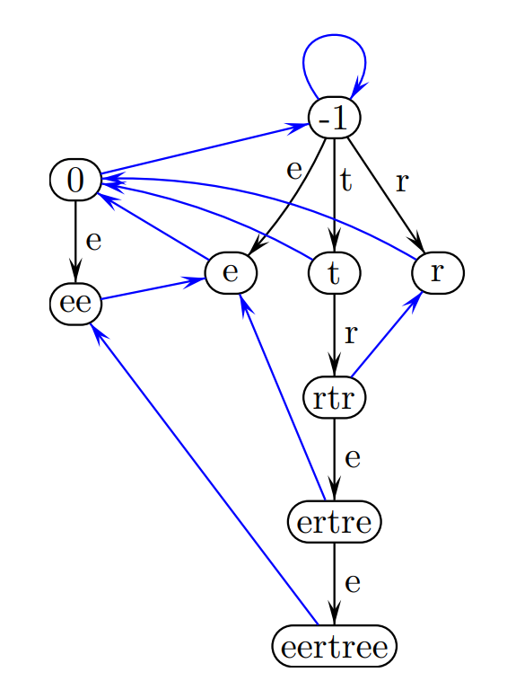

# EERTREE 重新学习

## 背景

发现还是不会[写题](https://ac.nowcoder.com/acm/contest/33189/F)，作为退役选手尝试努力重新系统性的学习一下 EERTREE（2022年8月）

也是想让自己被业务折磨的脑子放在一些喜欢的地方，由于本人没什么字符串背景，学习起来可能也比较费劲


## 预计学习路径

- [ ] 1 直接浅读一遍 EERTREE 原论文的简介和目录部分 https://arxiv.org/pdf/1506.04862.pdf
- [ ] 2 根据论文中的知识点 link 到一些历史问题和它的解决方案
- [ ] 3 延伸出来肯定要顺便重看一些古老的问题，例如 manacher,border,exkmp，好在之前还是会一些的，应该不会太复杂
- [ ] 4 精读 EERTREE 原论文，了解构造步骤和细节
- [ ] 5 根据原论文写一些实现，初步估计 rust 和 c++ 版本
- [ ] 6 手动解决回文串的一些经典问题（计数相关、正反插入、持久化）
- [ ] 7 解决写题中碰到的问题，例如
     1. https://ac.nowcoder.com/acm/contest/5633/F
     2. https://ac.nowcoder.com/acm/contest/33189/F
     3. bzoj 5384（已经没有题了，只能根据其他 [blog](https://blog.csdn.net/litble/article/details/80765636) 对拍了）
     4. https://codeforces.com/gym/101981/problem/M
- [ ] 8 补充阅读并初步完善实现版本，开源模板
- [ ] 9 addition 长期维护模板（因为要学习rust）


| step | 预期工时 | 预期时间    | 实际工时 | 实际完成时间 |
| ---- | -------- | ----------- | -------- | ------------ |
| 1    | 0.5d     | 8.6 - 8.6   | 0.5d     | 8.10         |
| 2    | 2d       | 8.6 - 8.8   |          |              |
| 3    | 2d       | 8.10 - 8.12 |          |              |
| 4    | 5d       | 8.13 - 8.17 |          |              |
| 5    | 5d       | 8.17 - 8.21 |          |              |
| 6    | 3d       | 8.22 - 8.26 |          |              |
| 7    | 2d       | 8.27 - 8.28 |          |              |
| 8    | 2d       | 8.29 - 9.1  |          |              |


## 1. 论文具体内容


### 定义

- 串 $s=a_1a_2...a_n$
- 反串 $\overleftarrow{s}=a_n...a_2a_1$
- 回文串 $s=\overleftarrow{s}$
- 字符集大小 $\sigma$
- 串长度 $|s|$
- 第 $i$ 个字符 $s[i]$
- 第 $i$ 到 $j$ 个字符构成的子串 $s[i..j]$
- rich串，表示不同回文子串个数等于自身长度的串
- 空串 $\varepsilon$，在本文中不是回文串
- 子回文串 $s[l..r]$ 中心 $(l+r)/2$
- 子回文串 $s[l..r]$ 半径 $\lceil(r-l+1)/2\rceil$

### 以前的进展

1. 寻找所有最长回文子串、最长回文前缀、后缀

     Manacher 算法，线性
     
     Manacher, G.: A new linear-time on-line algorithm finding the smallest initial
palindrome of a string. J. ACM 22(3), 346–351 (1975)


2. 计数、寻找所有不同回文子串

     离线 线性

      Groult, R., Prieur, E., Richomme, G.: Counting distinct palindromes in a word in
linear time. Inform. Process. Lett. 110, 908–912 (2010)

     在线 $n\log\sigma$

     Kosolobov, D., Rubinchik, M., Shur, A.M.: Finding distinct subpalindromes online.
In: Proc. Prague Stringology Conference. PSC 2013. pp. 63–69. Czech Technical
University in Prague (2013)

3. 最小回文分解（找到最小的k,使得s正好由k个子回文串拼接而成）

     在线 $n\log{n}$

     Fici G., Gagie T., Kärkkäinen J., Kempa D.
A subquadratic algorithm for minimum palindromic factorization
J. Discrete Algorithms, 28 (2014), pp. 41-48

     I T., Sugimoto S., Inenaga S., Bannai H., Takeda M.
Computing palindromic factorizations and palindromic covers on-line
Combinatorial Pattern Matching - 25th Annual Symposium, CPM 2014. Proceedings, Lecture Notes in Computer Science, vol. 8486, Springer (2014), pp. 150-161

4. 生物交叉领域应用

   提到了一个叫 affix tree/affix array 的东西，感觉没有引入竞赛，看不太明白在做什么，大概是双向子串都弄到一个 tree-like 结构中，还是线性的，感觉很神奇

   https://pdf.sciencedirectassets.com/271538/1-s2.0-S0304397507X06856/1-s2.0-S0304397507007360/main.pdf


   找到一篇有 affix tree 图例和构造方法的讲义

   http://wwwmayr.informatik.tu-muenchen.de/personen/maass/at_slides.pdf

### EERTREE简介

原文描述为 tree-like 的数据结构，主要可用于回文串**计数**和**分解**问题

1. 可以在线计算本质不同回文子串个数，支持动态尾插入
2. 空间复杂度线性，时间复杂度 $n\log{\sigma}$
3. 支持合并（joint）操作
4. 变种支持尾插入和尾删除、遍历固定字符集的rich串
5. 支持持久化操作undo
6. 用于最小回文分解问题


### EERTREE 具体构造、变种、解决问题方式

#### Basic Version

**接口**:
=== "cpp"
     ```cpp
     --8<-- "docs/badcw/string/eertree/codings/basic_interface.cc"
     ```
=== "rust"
     ```cpp
     --8<-- "docs/badcw/string/eertree/codings/basic_interface.rs"
     ```

**需要定义并维护以下数据结构**:

一个有向图，其中每个节点有一个从 1 开始的编号，每个节点代表一个本质不同回文子串

节点 $v$ 保存的信息是它代表的子串的长度 $len[v]$ 

EERTREE 初始化时有奇偶两个 root 节点，其中

- 偶根的长度为 0,编号为0
- 奇根的长度为 -1,编号为-1

$c$ 是一个字符，$v$ 和 $cvc$ 是 EERTREE 上两个节点，则连一条从 $v$ 到 $cvc$ 的有向边，边的信息为 $c$

对于根节点，奇根会连向所有出现的 $c$，偶根会连向所有出现的 $cc$

后缀链 link，$u$ 到 $v$ 有一条后缀链link说明 $v$ 节点是 $u$ 节点的最长后缀回文真子串

对于根节点，所有 $link[c]=0$，$link[0]=link[-1]=-1$

EERTREE示例，蓝色边为 link, 黑色边为原有向图



**性质**:

   - EERTREE 中的有向图点数级别 $O(n)$
   - 给定一个串 $S$，可以在 $O(n\log\sigma)$ 时间内构造它的 EERTREE

### 一些结论

1. 一个长度为 n 的串最多 n 个不同回文子串
2. 一个长度为 n 的随机串期望 $\sqrt{n\sigma}$ 个不同回文子串
3. 一个串$S$和一个字符$c$拼接起来的串$Sc$，最多会有一个回文子串没有出现在$S$中，且如果出现了这个子串是$Sc$的最长回文后缀

## 2.题单

1. https://www.spoj.com/problems/NUMOFPAL/
2. https://ac.nowcoder.com/acm/contest/5633/F
3. https://ac.nowcoder.com/acm/contest/33189/F
4. 20w 个操作，每次往s前或后塞入一个字符，每次都求本质不同子串个数
5. 长度为 n 的 rich 串计数